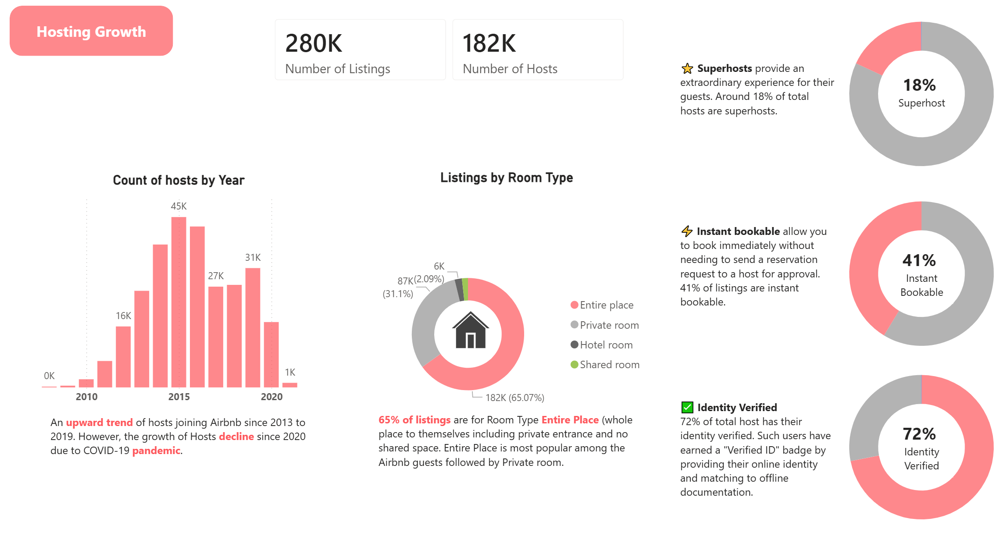
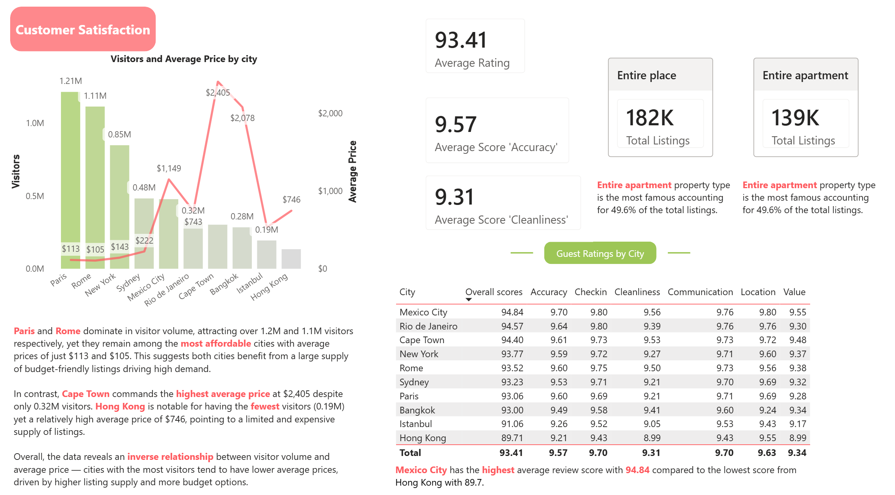

# 🏠 Global Airbnb Performance Dashboard
### Power BI | Data Analytics | Travel & Hospitality

A multi-page interactive Power BI dashboard analyzing **279,712 Airbnb listings** across **10 major cities** worldwide, built using the [Maven Analytics Airbnb Dataset](https://mavenanalytics.io/data-playground/airbnb-listings-reviews).

---

## 📊 Dashboard Pages

### 1. Overview


A high-level snapshot of the global Airbnb market, tracking listing growth over time and platform lifecycle stages — from Introduction (pre-2010) through Growth, Maturity, Decline, Re-invention, and the impact of COVID-19.

**Key metrics:**
- 279,712 total listings across 10 cities
- 182K hosts and 5.37M reviews
- 144 unique property types
- Peak new listings reached in 2015, followed by a sharp COVID-19 driven decline post-2019

---

### 2. Hosting Growth


Explores the supply side of the Airbnb market — who is hosting, what they are offering, and how trustworthy the host base is.

**Key insights:**
- Entire place listings dominate at **65%** of all listings
- Only **18%** of hosts hold Superhost status, signaling a quality opportunity
- **41%** of listings are instantly bookable
- **72%** of hosts have verified identities
- Host growth peaked in **2015** and has declined since 2020 due to COVID-19

---

### 3. Customer Satisfaction


Examines demand-side performance through guest reviews, satisfaction scores, and city-level pricing patterns.

**Key insights:**
- Global average guest rating: **93.41 / 100**
- **Paris** and **Rome** lead in visitor volume (1.21M and 1.11M) at affordable avg prices ($113 and $105)
- **Mexico City** ranks highest in overall guest satisfaction at **94.84**
- **Hong Kong** scores lowest at **89.71**, indicating room for quality improvement
- **Cape Town** shows an anomalous avg price spike ($2,405) driven by luxury listing outliers

---

## 🗂️ Dataset

| Property | Details |
|---|---|
| Source | [Maven Analytics Data Playground](https://mavenanalytics.io/data-playground/airbnb-listings-reviews) |
| Original source | [Inside Airbnb](http://insideairbnb.com/get-the-data.html) |
| License | Public Domain |
| Tables | Listings, Reviews |
| Total listings | 279,712 |
| Total reviews | 5,373,000+ |
| Cities covered | Paris, Rome, New York, Sydney, Mexico City, Rio de Janeiro, Cape Town, Bangkok, Istanbul, Hong Kong |

---

## 🧮 Key DAX Measures

```dax

-- Visitors (proxy)
Total Visitors = COUNTROWS('Reviews')

-- Average Rating (scaled to 100)
Avg Rating = AVERAGE('Listings'[review_scores_rating])

-- Superhost %
Superhost % = 
DIVIDE(
    COUNTROWS(FILTER('Listings', 'Listings'[host_is_superhost] = "t")),
    COUNTROWS('Listings')
)
```


---

## 🛠️ Tools Used

| Tool | Purpose |
|---|---|
| Power BI Desktop | Dashboard development and DAX modeling |
| Power Query | Data cleaning and transformation |
| DAX | Calculated measures and columns |
| Maven Analytics | Dataset source |

---

## 📁 Repository Structure

```
├── screenshots/
│   ├── overview.png
│   ├── hosting_growth.png
│   └── customer_satisfaction.png
├── AirbnbDashboard_Farwah.pbix
└── README.md
```

---

## 💡 Business Questions Answered

1. How does the Airbnb market differ across 10 major cities?
2. Which cities offer the best value for travelers?
3. What listing attributes drive the highest prices?
4. How does pricing vary by neighborhood within each city?
5. Are there seasonal trends in review volume across cities?
6. Which hosts and listings earn the highest review scores?
7. How does Superhost status affect pricing and reviews?
8. What share of listings belong to multi-listing (commercial) hosts?
9. How has listing growth evolved over time per city?
10. Which room types are most popular and profitable by city?

---

## 📥 Download Dashboard

The `.pbix` file is too large for GitHub (195MB). Download it directly from Google Drive:

👉 [Download Airbnb_Dashboard.pbix from Google Drive](https://drive.google.com/drive/folders/1EvcL_hQCNV2oIoN-T2TIvMXx8YbDSVv0?usp=sharing)

---

## 🚀 How to Use

1. Download the dataset from [Maven Analytics](https://mavenanalytics.io/data-playground/airbnb-listings-reviews)
2. Clone this repository
3. Open `Airbnb_Dashboard.pbix` in Power BI Desktop
4. Refresh the data source and point it to your downloaded dataset files
5. Explore the three dashboard pages using the city slicer to filter by location

---

## 👤 Farwah

Built as a data analytics portfolio project using publicly available Airbnb data.

---

*Data source: Inside Airbnb (Public Domain) via Maven Analytics*

